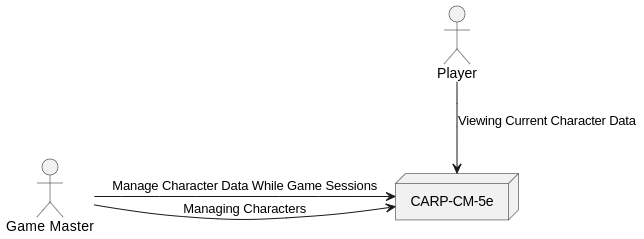

# Architecture 

This document contains architecture descriptions and documentation.

## Introduction & Goals

### Requirements Overview

* The application should work with up to hundreds of D&amp;D characters.
* Should be able to manage 2014 and 2025 characters.

### Quality Goals

* SOLID
* TDD
* Minimal amount of code.

### Relevant Stakeholders

* People, which don't want to manage their D&amp;D characters online.

## Architecture Constraints

* Clean Architecture (hexagonal architecture).
* Trying a domain and transaction based implementation.

## Context & Scope

TBD

## Solution Strategy

TBD

## Building Block View

### Context Diagram

### Module Diagram Level 0

TBD

### Component Diagram Level 0

TBD

### Component Diagram Level 0

TBD

## Runtime View

TBD

## Deployment View

TBD

## Crosscutting Concepts

* Optimistic locking provided by JPA.

### Domain Diagram

TBD

## Architecture Decisions

### Database

* Using optimistic locking to prevent data loss while saving records.

### Data Model

* Inheritance in token and battlemap token structure for saving data accesses.

## Quality

TBD

## Risks & Technical Dept

TBD

## Glossary

TBD